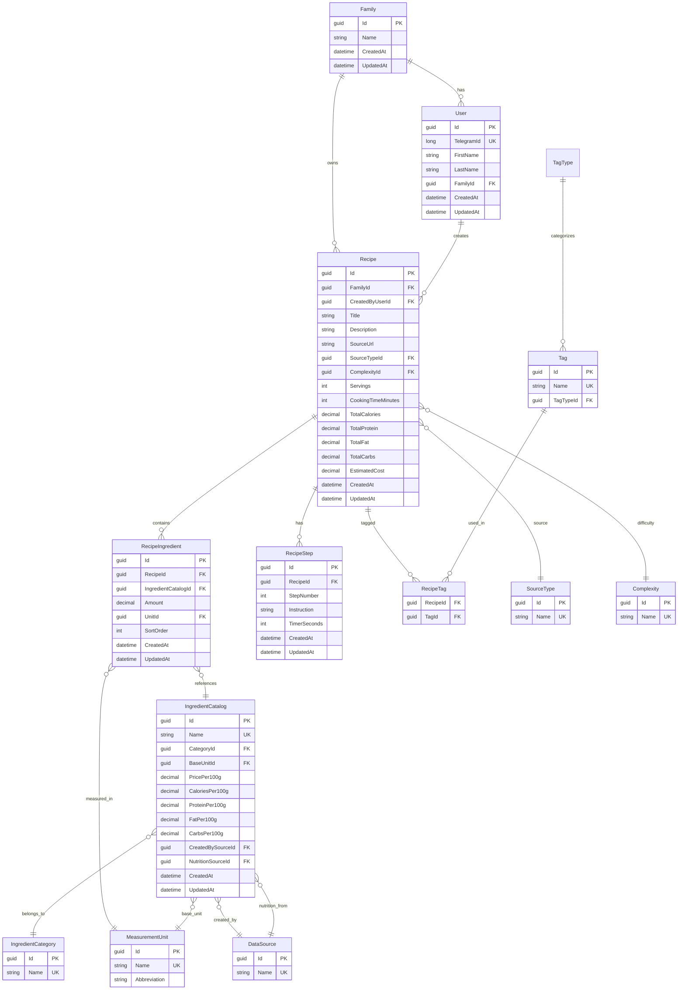

# CLAUDE.md

This file provides guidance to Claude Code (claude.ai/code) when working with code in this repository.

## О проекте

**Cooking** — личный кулинарный помощник. Telegram-бот + PWA для двух пользователей (автор и девушка), объединённых в одну "семью" (Family).

Ключевая ценность: закинул ссылку на Reels/текст рецепта → бот сам достаёт рецепт, структурирует его через LLM и считает КБЖУ/стоимость по каталогу ингредиентов.

## Текущее состояние реализации

Репозиторий — ранний скелет. `Cooking.Domain`, `Cooking.Application`, `Cooking.Infrastructure` пока содержат только шаблонные `Class1.cs`, а `Cooking.Api`/`Cooking.Worker` — дефолтный boilerplate от `dotnet new` (weather forecast, пример `Worker`). Тестов, `.gitignore`, git-репозитория ещё нет. В `docker-compose.yml` подняты Postgres и RabbitMQ, но пакеты EF Core, MassTransit, MediatR, Telegram.Bot и т.д. в `.csproj` ещё не подключены — вся схема ниже описывает целевую архитектуру, а не то, что уже есть в коде.

Все проекты нацелены на **net8.0** (nullable + implicit usings включены).

## Структура решения

```
Cooking/
├── docker-compose.yml          # PostgreSQL + RabbitMQ
├── Cooking.sln
└── src/
    ├── Cooking.Domain/          # Entities, enums, interfaces (Class Library)
    ├── Cooking.Application/     # MediatR handlers, DTOs, use cases (Class Library)
    ├── Cooking.Infrastructure/  # EF Core, внешние API (Class Library)
    ├── Cooking.Api/             # Web API + Telegram webhook (ASP.NET Core Web API)
    └── Cooking.Worker/          # MassTransit consumers — фоновая обработка (Worker Service)
```

Зависимости между проектами (Clean Architecture, ссылки идут только "внутрь"):

```
Domain ← Application ← Infrastructure
                     ← Api
                     ← Worker
```

## Стек

- .NET 8, C#
- PostgreSQL (EF Core, Code First, миграции)
- RabbitMQ + MassTransit (асинхронная обработка видео/аудио)
- MediatR (CQRS: commands/queries)
- Telegram.Bot SDK
- Whisper API (OpenAI) — Speech-to-Text
- Claude API / OpenAI API — структурирование рецептов через LLM
- SignalR — реалтайм (будущее: список покупок)
- PWA (фронтенд, будет позже)

## Команды

- Сборка всего решения: `dotnet build Cooking.sln`
- Запуск API: `dotnet run --project src/Cooking.Api`
- Запуск Worker: `dotnet run --project src/Cooking.Worker`
- Поднять инфраструктуру (Postgres на 5432, RabbitMQ на 5672 / management UI на 15672): `docker compose up -d`
- Тестового проекта пока нет; когда появится, точка входа — `dotnet test` (для одного теста: `--filter FullyQualifiedName~<Name>`)

## MVP — скоуп первой версии

### Платформы
- Telegram-бот — создание + поиск (делается первым)
- PWA — отображение рецептов (делается вторым)

### Создание рецептов
- Вручную (текст)
- Из Instagram Reels (скачивание аудио → Whisper → LLM → структурированный рецепт)

### Карточка рецепта
- Название, описание
- Ингредиенты (ссылка на каталог IngredientCatalog по ID)
- Пошаговые инструкции с таймерами
- Ссылка на источник (URL видео или сайта)
- КБЖУ (считается из каталога ингредиентов)
- Теги (тип приёма, кухня, сложность, время готовки)
- Стоимость (считается из каталога ингредиентов)
- Масштабирование порций

### Поиск
- По названию (полнотекстовый)
- Семантический (через LLM)

### Многопользовательность
- Сразу на двоих (Family)
- Авторизация через Telegram Login Widget
- Общее: рецепты, списки покупок
- Личное: избранное

### Справочник ингредиентов
- Название, категория, КБЖУ на 100г, цена, единица измерения
- Автозаполнение через LLM при парсинге рецепта
- Два отдельных поля источника: кто создал запись (CreatedBySourceId) и откуда КБЖУ (NutritionSourceId)

### Отложено (не в MVP)
- Список покупок с реалтайм-синхронизацией (SignalR)
- Лайк/дизлайк от каждого пользователя
- YouTube, сайты как источники
- Поиск по фото продуктов, поиск по ингредиентам
- История готовок, рекомендации
- Импорт/экспорт в JSON

## Схема базы данных (Code First, EF Core + PostgreSQL)

Все основные entities наследуют `BaseEntity` (Id: Guid, CreatedAt: DateTime, UpdatedAt: DateTime).

### ERD (mermaid)



### Основные таблицы

#### Family
- Id (Guid, PK)
- Name (string)
- CreatedAt, UpdatedAt

#### User
- Id (Guid, PK)
- TelegramId (long, unique)
- FirstName (string)
- LastName (string?)
- FamilyId (Guid, FK → Family)
- CreatedAt, UpdatedAt

#### Recipe
- Id (Guid, PK)
- FamilyId (Guid, FK → Family)
- CreatedByUserId (Guid, FK → User)
- Title (string)
- Description (string?)
- SourceUrl (string?)
- SourceTypeId (Guid, FK → SourceType)
- ComplexityId (Guid, FK → Complexity)
- Servings (int)
- CookingTimeMinutes (int)
- TotalCalories (decimal)
- TotalProtein (decimal)
- TotalFat (decimal)
- TotalCarbs (decimal)
- EstimatedCost (decimal)
- CreatedAt, UpdatedAt

#### IngredientCatalog
- Id (Guid, PK)
- Name (string, unique)
- CategoryId (Guid, FK → IngredientCategory)
- BaseUnitId (Guid, FK → MeasurementUnit) — базовая единица для расчёта КБЖУ
- PricePer100g (decimal)
- CaloriesPer100g (decimal)
- ProteinPer100g (decimal)
- FatPer100g (decimal)
- CarbsPer100g (decimal)
- CreatedBySourceId (Guid, FK → DataSource) — кто создал запись (Manual, LLM, FatSecret)
- NutritionSourceId (Guid, FK → DataSource) — откуда КБЖУ (Manual, LLM, FatSecret)
- CreatedAt, UpdatedAt

#### RecipeIngredient
- Id (Guid, PK)
- RecipeId (Guid, FK → Recipe)
- IngredientCatalogId (Guid, FK → IngredientCatalog)
- Amount (decimal)
- UnitId (Guid, FK → MeasurementUnit) — единица в этом рецепте (может отличаться от базовой)
- SortOrder (int) — порядок отображения
- CreatedAt, UpdatedAt

#### RecipeStep
- Id (Guid, PK)
- RecipeId (Guid, FK → Recipe)
- StepNumber (int) — порядок шага (1, 2, 3...)
- Instruction (string) — текст шага
- TimerSeconds (int?) — если заполнено, PWA показывает кнопку таймера
- CreatedAt, UpdatedAt

#### Tag
- Id (Guid, PK)
- Name (string, unique)
- TagTypeId (Guid, FK → TagType)

#### RecipeTag (промежуточная, many-to-many)
- RecipeId (Guid, FK → Recipe)
- TagId (Guid, FK → Tag)
- Composite PK: (RecipeId, TagId)

### Справочники (reference tables, заполняются при seed)

Все справочники: Id (Guid, PK) + Name (string, unique). Без CreatedAt/UpdatedAt.

- **SourceType** — источник рецепта: Manual, Instagram, YouTube, Website
- **Complexity** — сложность: Easy, Medium, Hard
- **IngredientCategory** — категория ингредиента: Мясо, Овощи, Крупы, Молочные, Специи и т.д.
- **MeasurementUnit** — единица измерения: г, мл, шт, ст.л., ч.л. (поля: Name, Abbreviation)
- **DataSource** — источник данных: Manual, LLM, FatSecret
- **TagType** — тип тега: MealType, Cuisine, CookingMethod и т.д.

## Архитектурные решения

- Все enums вынесены в отдельные справочные таблицы (не enum в коде)
- Many-to-many для тегов через промежуточную таблицу RecipeTag — соблюдает 3НФ
- КБЖУ и стоимость рецепта считаются на лету из IngredientCatalog: `amount × catalogValue / 100`
- Масштабирование порций — пересчёт на фронте, базовые Servings хранятся в Recipe
- Обработка Instagram-видео асинхронная через RabbitMQ: бот кидает сообщение → Worker скачивает, транскрибирует, парсит → отправляет результат обратно
- BaseEntity (Id, CreatedAt, UpdatedAt) — базовый класс для всех основных entities

## Docker (локальная разработка)

Postgres (`recipe-db`, порт 5432) и RabbitMQ (`recipe-mq`, AMQP 5672 / management UI 15672) — см. `docker-compose.yml` в корне.

## Connection strings (appsettings.Development.json)

```json
{
  "ConnectionStrings": {
    "DefaultConnection": "Host=localhost;Port=5432;Database=recipe_db;Username=recipe_user;Password=recipe_pass"
  },
  "RabbitMq": {
    "Host": "localhost",
    "Username": "guest",
    "Password": "guest"
  }
}
```

Сейчас эта конфигурация уже есть в `src/Cooking.Api/appsettings.Development.json`; в `Cooking.Worker/appsettings.Development.json` её пока нет.

## Хостинг (прод)

- VPS: Hetzner CX23 (2 vCPU, 4GB RAM, 40GB SSD, ~€4/мес)
- Всё в Docker на VPS
- Whisper API + LLM API: ~$2-4/мес при 20-30 рецептах