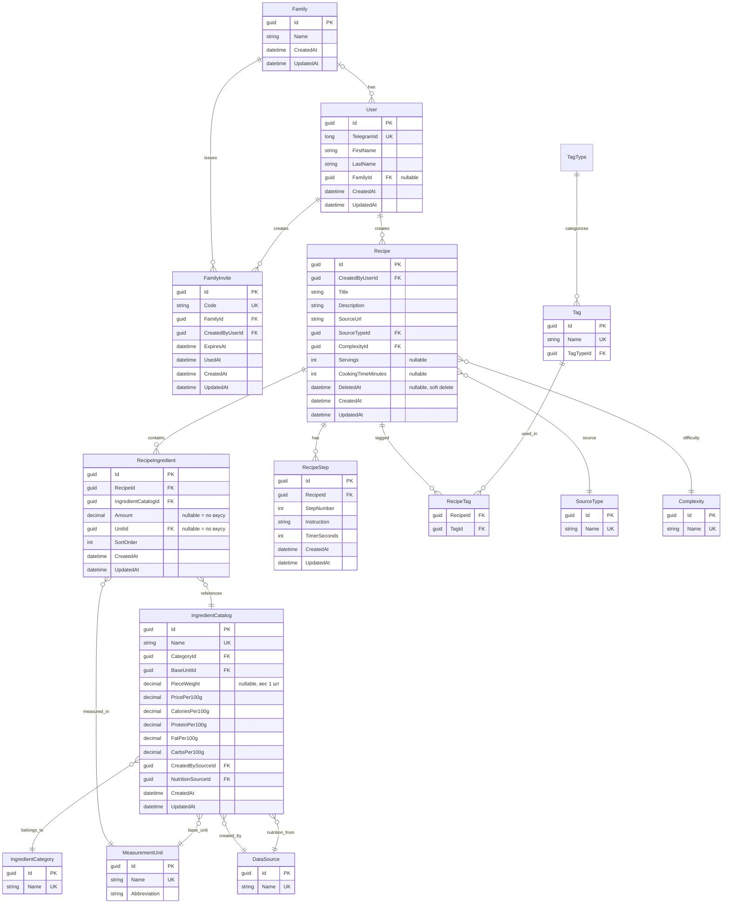

# CLAUDE.md

This file provides guidance to Claude Code (claude.ai/code) when working with code in this repository.

## О проекте

**Cooking** — личный кулинарный помощник. Telegram-бот + PWA. Изначально для автора и девушки, но бот можно расшарить друзьям: каждый пользователь самостоятельный, а семьи (Family) — группы, внутри которых рецепты общие.

Ключевая ценность: закинул ссылку на Reels/текст рецепта → бот сам достаёт рецепт, структурирует его через LLM и считает КБЖУ/стоимость по каталогу ингредиентов.

## Текущее состояние реализации

Готово: EF Core + миграции, КБЖУ и стоимость рецепта (`NutritionCalculator`), справочники с seed'ом, CRUD каталога ингредиентов, тегов, Family/User с приглашениями, Recipe CRUD (доступ по семье, soft delete), Telegram-бот (регистрация, семьи, список/поиск/карточка рецептов), LLM-разбор рецепта из текста (черновик → превью → подтверждение, см. «Разбор рецептов из текста»), Serilog/Seq, юнит-тесты (xUnit + EF InMemory) и CI. Каждая фича — `I<Feature>RepositoryService` в Application + реализация в `Infrastructure/Repositories`, MediatR-хендлеры тонкие, ошибки — `FluentResults` + `AppError(ErrorCode)` → HTTP-статус в `BaseController`.

Ещё нет: авторизации (пока `UserId` передаётся в запросе), PWA.

Все проекты нацелены на **net8.0** (nullable + implicit usings включены).

## Структура решения

```
Cooking/
├── docker-compose.yml          # PostgreSQL + RabbitMQ
├── Cooking.sln
└── src/
    ├── Cooking.Domain/          # Entities, enums, interfaces (Class Library)
    ├── Cooking.Application/     # MediatR handlers, DTOs, use cases (Class Library)
    ├── Cooking.Infrastructure/  # EF Core, внешние API (Class Library)
    ├── Cooking.Bot/             # Telegram-бот: обработчик апдейтов, клавиатуры, polling/webhook (Class Library)
    ├── Cooking.Api/             # Web API; хостит бота в своём процессе (ASP.NET Core Web API)
    └── Cooking.Worker/          # Заготовка под отдельный процесс фоновой обработки; пока не используется (см. «Разбор рецептов из текста»)
```

Зависимости между проектами (Clean Architecture, ссылки идут только "внутрь"):

```
Domain ← Application ← Infrastructure
                     ← Bot ← Api (хостит бота)
                     ← Worker
```

Бот — такой же слой представления, как контроллеры Api, поэтому живёт в отдельной библиотеке, а не в Api/Application/Infrastructure. Когда Worker'у понадобится писать пользователю (например, «рецепт из Reels готов»), это делается через интерфейс в Application с реализацией в Infrastructure, а не ссылкой Worker → Bot.

## Стек

- .NET 8, C#
- PostgreSQL (EF Core, Code First, миграции)
- Фоновая обработка — очередь в памяти процесса (`Channel` + `BackgroundService`) за интерфейсом; RabbitMQ + MassTransit — только если понадобится надёжность/отдельный процесс
- MediatR (CQRS: commands/queries)
- Telegram.Bot SDK
- Whisper API (OpenAI) — Speech-to-Text
- Claude API / OpenAI API — структурирование рецептов через LLM
- SignalR — реалтайм (будущее: список покупок)
- PWA (фронтенд, будет позже)

## Команды

- Сборка всего решения: `dotnet build Cooking.sln`
- Запуск API: `dotnet run --project src/Cooking.Api`
- Запуск Worker: `dotnet run --project src/Cooking.Worker`
- Поднять инфраструктуру (Postgres на 5432, RabbitMQ на 5672 / management UI на 15672): `docker compose up -d`
- Тесты: `dotnet test` (для одного теста: `--filter FullyQualifiedName~<Name>`). `tests/Cooking.Application.Tests` — репозитории на EF InMemory; `tests/Cooking.Bot.Tests` — только чистые функции бота (разбор команд, форматирование карточки)

## MVP — скоуп первой версии

### Платформы
- Telegram-бот — создание + поиск (делается первым)
- PWA — отображение рецептов (делается вторым)

### Создание рецептов
- Вручную (текст)
- Из Instagram Reels (скачивание аудио → Whisper → LLM → структурированный рецепт)

### Карточка рецепта
- Название, описание
- Ингредиенты (ссылка на каталог IngredientCatalog по ID)
- Пошаговые инструкции с таймерами
- Ссылка на источник (URL видео или сайта)
- КБЖУ (считается из каталога ингредиентов)
- Теги (тип приёма, кухня, сложность, время готовки)
- Стоимость (считается из каталога ингредиентов)
- Масштабирование порций

### Поиск
- По названию (полнотекстовый)
- Семантический (через LLM)

### Многопользовательность
- Много пользователей и много семей. `/start` регистрирует пользователя **без семьи**; дальше он может создать семью или вступить по приглашению
- Приглашение — одноразовый код с ограниченным сроком (FamilyInvite), передаётся deep link'ом `t.me/<bot>?start=<code>`
- Пользователь состоит максимум в одной семье. Последний вышедший участник удаляет семью
- Авторизация через Telegram Login Widget
- Рецепт принадлежит автору (CreatedByUserId), а не семье. В семье видны рецепты всех её участников; при вступлении/выходе ничего не переносится — рецепты уходят вместе с автором
- Права на рецепт: **смотреть и редактировать** — автор и участники его семьи; **удалять** — только автор. Постороннему API отвечает 404 (не 403), чтобы не раскрывать чужие рецепты
- Удаление рецепта — soft delete (`DeletedAt`), удалённые скрыты глобальным query filter'ом EF
- Общее в семье: рецепты участников, списки покупок (принадлежат семье)
- Личное: избранное

### Справочник ингредиентов
- Название, категория, КБЖУ на 100г, цена, единица измерения
- Автозаполнение через LLM при парсинге рецепта
- Два отдельных поля источника: кто создал запись (CreatedBySourceId) и откуда КБЖУ (NutritionSourceId)

### Отложено (не в MVP)
- Список покупок с реалтайм-синхронизацией (SignalR)
- Лайк/дизлайк от каждого пользователя
- YouTube, сайты как источники
- Поиск по фото продуктов, поиск по ингредиентам
- История готовок, рекомендации
- Импорт/экспорт в JSON
- Видимость рецепта (Private / Family / Public, справочник RecipeVisibility): владение (кто редактирует) ≠ видимость (кто видит)
- Общий каталог публичных рецептов (база знаний для всех пользователей, с пагинацией), шаринг рецепта ссылкой, «скопировать себе»
- Сканирование чека → цены (KZT) в каталог ингредиентов (см. идею в конце файла)
- Текст на экране в Reels (рецепт только в титрах): кадры из видео → Claude vision
- Inline-режим: `@бот запрос` в любом чате (нужен `IsPersonal = true`)
- Возможная фича (в реальности пока не встречалась): ссылка на сайт внутри присланного текста → сохранять как источник рецепта (SourceType Website)

## Схема базы данных (Code First, EF Core + PostgreSQL)

Все основные entities наследуют `BaseEntity` (Id: Guid, CreatedAt: DateTime, UpdatedAt: DateTime).

### ERD (mermaid)


```mermaid
erDiagram
  Family |o--o{ User : has
  Family ||--o{ FamilyInvite : issues
  User ||--o{ FamilyInvite : creates
  User ||--o{ Recipe : creates
  Recipe ||--o{ RecipeIngredient : contains
  Recipe ||--o{ RecipeStep : has
  Recipe ||--o{ RecipeTag : tagged
  Tag ||--o{ RecipeTag : used_in
  TagType ||--o{ Tag : categorizes
  RecipeIngredient }o--|| IngredientCatalog : references
  RecipeIngredient }o--|| MeasurementUnit : measured_in
  IngredientCatalog }o--|| IngredientCategory : belongs_to
  IngredientCatalog }o--|| MeasurementUnit : base_unit
  IngredientCatalog }o--|| DataSource : created_by
  IngredientCatalog }o--|| DataSource : nutrition_from
  Recipe }o--|| SourceType : source
  Recipe }o--|| Complexity : difficulty

  Family {
    guid Id PK
    string Name
    datetime CreatedAt
    datetime UpdatedAt
  }

  User {
    guid Id PK
    long TelegramId UK
    string FirstName
    string LastName
    guid FamilyId FK "nullable"
    datetime CreatedAt
    datetime UpdatedAt
  }

  FamilyInvite {
    guid Id PK
    string Code UK
    guid FamilyId FK
    guid CreatedByUserId FK
    datetime ExpiresAt
    datetime UsedAt
    datetime CreatedAt
    datetime UpdatedAt
  }

  Recipe {
    guid Id PK
    guid CreatedByUserId FK
    string Title
    string Description
    string SourceUrl
    guid SourceTypeId FK
    guid ComplexityId FK
    int Servings "nullable"
    int CookingTimeMinutes "nullable"
    datetime DeletedAt "nullable, soft delete"
    datetime CreatedAt
    datetime UpdatedAt
  }

  SourceType {
    guid Id PK
    string Name UK
  }

  Complexity {
    guid Id PK
    string Name UK
  }

  IngredientCatalog {
    guid Id PK
    string Name UK
    guid CategoryId FK
    guid BaseUnitId FK
    decimal PieceWeight "nullable, вес 1 шт"
    decimal PricePer100g
    decimal CaloriesPer100g
    decimal ProteinPer100g
    decimal FatPer100g
    decimal CarbsPer100g
    guid CreatedBySourceId FK
    guid NutritionSourceId FK
    datetime CreatedAt
    datetime UpdatedAt
  }

  IngredientCategory {
    guid Id PK
    string Name UK
  }

  DataSource {
    guid Id PK
    string Name UK
  }

  MeasurementUnit {
    guid Id PK
    string Name UK
    string Abbreviation
  }

  RecipeIngredient {
    guid Id PK
    guid RecipeId FK
    guid IngredientCatalogId FK
    decimal Amount "nullable = по вкусу"
    guid UnitId FK "nullable = по вкусу"
    int SortOrder
    datetime CreatedAt
    datetime UpdatedAt
  }

  RecipeStep {
    guid Id PK
    guid RecipeId FK
    int StepNumber
    string Instruction
    int TimerSeconds
    datetime CreatedAt
    datetime UpdatedAt
  }

  Tag {
    guid Id PK
    string Name UK
    guid TagTypeId FK
  }

  RecipeTag {
    guid RecipeId FK
    guid TagId FK
  }
```

### Основные таблицы

#### Family
- Id (Guid, PK)
- Name (string)
- CreatedAt, UpdatedAt

#### User
- Id (Guid, PK)
- TelegramId (long, unique)
- FirstName (string)
- LastName (string?)
- FamilyId (Guid?, FK → Family) — null, пока пользователь не состоит в семье
- CreatedAt, UpdatedAt

#### FamilyInvite
- Id (Guid, PK)
- Code (string, unique, ≤ 64 символов `[A-Za-z0-9_-]` — ограничение start-параметра Telegram)
- FamilyId (Guid, FK → Family, cascade delete)
- CreatedByUserId (Guid, FK → User)
- ExpiresAt (DateTime) — срок действия (7 дней)
- UsedAt (DateTime?) — null, пока приглашение не использовано (одноразовое)
- CreatedAt, UpdatedAt

#### Recipe
- Id (Guid, PK)
- CreatedByUserId (Guid, FK → User) — владелец рецепта
- Title (string)
- Description (string?)
- SourceUrl (string?)
- SourceTypeId (Guid, FK → SourceType)
- ComplexityId (Guid, FK → Complexity)
- Servings (int?) — null, если в источнике не указано (не выдумываем)
- CookingTimeMinutes (int?) — null, если в источнике не указано
- DeletedAt (DateTime?) — soft delete; не null → рецепт удалён (query filter прячет его и его ингредиенты/шаги/теги)
- CreatedAt, UpdatedAt

КБЖУ и стоимость в Recipe **не хранятся** — см. «Архитектурные решения».

#### IngredientCatalog
- Id (Guid, PK)
- Name (string, unique)
- CategoryId (Guid, FK → IngredientCategory)
- BaseUnitId (Guid, FK → MeasurementUnit) — базовая единица для расчёта КБЖУ
- PieceWeight (decimal?) — вес/объём 1 шт в базовой единице, чтобы пересчитать «2 шт» в граммы; null — штуками не считают
- PricePer100g (decimal) — в тенге (KZT); у ингредиентов, созданных LLM, — 0 (вносится вручную)
- CaloriesPer100g (decimal)
- ProteinPer100g (decimal)
- FatPer100g (decimal)
- CarbsPer100g (decimal)
- CreatedBySourceId (Guid, FK → DataSource) — кто создал запись (Manual, LLM, FatSecret)
- NutritionSourceId (Guid, FK → DataSource) — откуда КБЖУ (Manual, LLM, FatSecret)
- CreatedAt, UpdatedAt

#### RecipeIngredient
- Id (Guid, PK)
- RecipeId (Guid, FK → Recipe)
- IngredientCatalogId (Guid, FK → IngredientCatalog)
- Amount (decimal?) — null вместе с UnitId = «по вкусу» (соль, масло для жарки); в расчёт КБЖУ/стоимости не идёт
- UnitId (Guid?, FK → MeasurementUnit) — единица в этом рецепте (может отличаться от базовой)
- SortOrder (int) — порядок отображения
- CreatedAt, UpdatedAt

#### RecipeStep
- Id (Guid, PK)
- RecipeId (Guid, FK → Recipe)
- StepNumber (int) — порядок шага (1, 2, 3...)
- Instruction (string) — текст шага
- TimerSeconds (int?) — если заполнено, PWA показывает кнопку таймера
- CreatedAt, UpdatedAt

#### Tag
- Id (Guid, PK)
- Name (string, unique)
- TagTypeId (Guid, FK → TagType)

#### RecipeTag (промежуточная, many-to-many)
- RecipeId (Guid, FK → Recipe)
- TagId (Guid, FK → Tag)
- Composite PK: (RecipeId, TagId)

### Справочники (reference tables, заполняются при seed)

Все справочники: Id (Guid, PK) + Name (string, unique). Без CreatedAt/UpdatedAt.

- **SourceType** — источник рецепта: Manual, Instagram, YouTube, Website
- **Complexity** — сложность: Easy, Medium, Hard
- **IngredientCategory** — категория ингредиента: Мясо, Овощи, Крупы, Молочные, Специи и т.д.
- **MeasurementUnit** — единица измерения: г, мл, шт, ст.л., ч.л. (поля: Name, Abbreviation)
- **DataSource** — источник данных: Manual, LLM, FatSecret
- **TagType** — тип тега: MealType, Cuisine, CookingMethod, Diet
- **Tag** (не чистый справочник: есть TagTypeId) — базовый набор тегов по каждому типу

Seed — через `HasData` в EF-конфигурациях, значения в `Infrastructure/Persistence/Seed/ReferenceDataSeed.cs`. Id фиксированные: константы в `Cooking.Domain/ReferenceData/ReferenceIds.cs` (например, `ReferenceIds.SourceTypes.Instagram`) — код ссылается на них напрямую, а не ищет по имени. Добавил/изменил seed → новая миграция; Id уже существующих записей не менять.

## Архитектурные решения

- Все enums вынесены в отдельные справочные таблицы (не enum в коде)
- Many-to-many для тегов через промежуточную таблицу RecipeTag — соблюдает 3НФ
- КБЖУ и стоимость рецепта **не хранятся**, а считаются при каждом показе из IngredientCatalog по **сырой** массе: `количество в базовой единице × значение на 100 / 100` — изменение цены/КБЖУ/формулы сразу отражается во всех рецептах. Считает `Application/Nutrition/NutritionCalculator` (C#, а не VIEW в БД — чтобы тестировать и менять формулу в одном месте). Пересчёт единиц: г и мл 1:1 (плотности пока нет — если понадобится, добавить поле в каталог и учесть его в `ToBaseAmount`), ст.л. = 15, ч.л. = 5, стакан = 250, щепотка = 0.5, шт — через `PieceWeight`. «По вкусу» не считается; ингредиенты, которые не пересчитать (шт без веса), перечисляются как «не учтено». Показывается КБЖУ всего блюда и на порцию; на 100 г готового блюда — нет (нужен вес готового блюда, отложено)
- Порции: пока одинаковые (`Servings`). Личный размер порции / вес готового блюда — отложено
- Масштабирование порций — пересчёт на фронте, базовые Servings хранятся в Recipe
- Долгая обработка (LLM, позже Reels) — в фоне через `IRecipeParsingQueue`, а не в обработчике апдейта: polling обрабатывает апдейты по одному, и 15 секунд LLM у одного пользователя задержали бы всех остальных
- BaseEntity (Id, CreatedAt, UpdatedAt) — базовый класс для всех основных entities

## Telegram-бот

- Код в `src/Cooking.Bot/`; Api подключает его двумя строками: `AddTelegramBot(configuration)` и `app.MapTelegramWebhook()`. Вся логика — `BotUpdateHandler` (scoped, работает через MediatR); транспорт выбирается настройкой `Telegram:UseWebhook`:
  - `false` (разработка) — `BotPollingService`, long polling, публичный адрес не нужен;
  - `true` (прод) — `TelegramWebhookEndpoint` (minimal API `POST /api/telegram/webhook`, маршрут есть только в webhook-режиме; проверяет заголовок `X-Telegram-Bot-Api-Secret-Token`) + `BotWebhookRegistrationService` регистрирует webhook при старте.
- Для разработки — отдельный dev-бот (Telegram не даёт одному боту одновременно polling и webhook).
- Токен **никогда** не коммитится: локально `dotnet user-secrets set "Telegram:BotToken" "<token>" --project src/Cooking.Api`, в проде — переменные окружения `Telegram__BotToken`, `Telegram__UseWebhook=true`, `Telegram__WebhookUrl`, `Telegram__WebhookSecretToken`.
- Без токена Api стартует без бота (REST работает).
- Бот не хранит состояние диалога. Поиск рецептов: `/search <запрос>`, либо кнопка «Найти рецепт» / `/search` без аргументов → список + сообщение `BotTexts.SearchPrompt` с ForceReply, и ответ на него = запрос. Обычный текст без команды (от 40 символов) и ответ на `BotTexts.RecipePrompt` (кнопка «Создать рецепт») — это рецепт для разбора. Список команд (`BotCommandNames.All`) регистрируется в Telegram при старте.

## Разбор рецептов из текста (LLM)

Вся логика — в Application (`RecipeDrafts/`), бот и `RecipeDraftsController` — тонкие клиенты одних и тех же команд (PWA будет вызывать их же).

1. `CreateRecipeDraftCommand` — сохраняет `RecipeDraft` (исходный текст, `ContentJson = null`) и кладёт `RecipeParsingJob(DraftId)` в `IRecipeParsingQueue`.
2. `RecipeParsingBackgroundService` (Infrastructure) разбирает очередь, до `RecipeParsing:MaxParallelism` задач параллельно, каждую — через `ParseRecipeDraftCommand`.
3. `IRecipeTextParser` (реализация `ClaudeRecipeTextParser`, structured outputs) возвращает `ParsedRecipe` — имена и коды без наших Id. В промпт идут названия из каталога (чтобы не плодить дубли) и теги из базы (LLM выбирает только из них).
4. `RecipeDraftMapper` (чистый, покрыт тестами) переводит ответ в `RecipeDraftContent`: ингредиент — либо Id из каталога (сравнение без регистра/пробелов, ё = е), либо данные нового ингредиента; неизвестные единицы/пустое количество → «по вкусу»; порции/время из текста и оценки ИИ хранятся отдельно.
5. Итог уходит пользователю через `IRecipeDraftNotifier` (бот: `BotRecipeDraftNotifier` — превью с кнопками «Сохранить» / «Отмена» / «Оценить порции и время»; без бота — `NullRecipeDraftNotifier`).
6. `ConfirmRecipeDraftCommand` — создаёт недостающие ингредиенты (`CreatedBySource = NutritionSource = LLM`, цена 0; в карточке помечены 🤖), сохраняет рецепт, удаляет черновик. До подтверждения ни в Recipe, ни в каталог ничего не пишется.

8. Изменение сохранённого рецепта — `EditRecipeCommand` (доступ как на редактирование: автор и семья): черновик из рецепта (`RecipeDraftMapper.FromRecipe`, в `RecipeDraftContent.RecipeId` — ссылка на рецепт, источник сохраняется) сразу с правкой → дальше как п. 7; `ConfirmRecipeDraftCommand` для такого черновика вызывает `Update` вместо `Create`. В боте — кнопки под карточкой: «✏️ Изменить» (ForceReply «Что поменять?», Id рецепта в невидимой ссылке `https://recipe.invalid/{recipeId}`) и «🗑 Удалить» (только автору, с подтверждением; soft delete).
- Несколько блюд в одном тексте (рацион дня, подборка, варианты начинок — каждый вариант отдельно; соус/гарнир — часть блюда): LLM отвечает `ParsedRecipes { Dishes, Recipes }`, каждое блюдо — свой черновик (первое — в исходный, остальные — `CreateSiblingAsync` с тем же текстом и ссылкой), в превью «Блюдо 2 из 3» (`RecipeDraftContent.DishNumber/DishCount`, правка их сохраняет). Блюд больше `RecipeDraftLimits.MaxDishes` (5) → LLM отдаёт только названия, черновик ждёт выбора (`RecipeDraft.DishChoicesJson`, `IRecipeDraftNotifier.DishChoiceRequiredAsync`); `SelectRecipeDraftDishesCommand` (`POST api/recipe-drafts/{id}/dishes`) → та же задача разбирает только выбранные (`SelectedDishesJson`). В боте выбор — кнопки ✅/⬜, отметки хранятся в самой клавиатуре (`BotKeyboards.ToggleDish`).
- Черновик виден только автору, живёт сутки; просроченные удаляются при создании нового.
- Очередь — в памяти процесса: задачи, не обработанные до перезапуска, теряются (черновик просто истечёт). Нужна надёжность — новая реализация `IRecipeParsingQueue` на брокере, команды не меняются.
- Настройки — секция `Anthropic` (`Model`, `Effort`, `MaxTokens`, `RefusalFallback`) в appsettings: модель меняется конфигом. Ключ — только `dotnet user-secrets set "Anthropic:ApiKey" "<key>" --project src/Cooking.Api` (прод: `Anthropic__ApiKey`). Без ключа Api стартует, а разбор отвечает «не настроен».
7. Правка — `CorrectRecipeDraftCommand`: текст правки пишется в `RecipeDraft.PendingCorrection`, в очередь уходит та же `RecipeParsingJob(DraftId)`. `ParseRecipeDraftCommand` видит правку и отправляет LLM исходный текст + текущую версию (`RecipeDraftMapper.ToCorrectionJson`) + правку; ответ проходит тот же маппер. Пока правка не применена, черновик нельзя сохранить/оценить/править повторно (LogicConflict), но можно показать. Неудачная правка черновик не удаляет — остаётся прежняя версия (`IRecipeDraftNotifier.DraftCorrectionFailedAsync`).
- В боте правка — ответ (reply) на сообщение с превью: Id черновика бот достаёт из кнопок превью, которые Telegram присылает вместе с `reply_to_message` (`BotCallbacks.FindDraftId`) — состояние не хранится. Старое превью редактируется в «✏️ Применяю правку…» без кнопок. Кнопка «✏️ Исправить» присылает «Что поправить?» с ForceReply; Id черновика и превью спрятаны в невидимой ссылке `https://draft.invalid/{draftId}/{previewMessageId}` (`BotCallbacks.DraftEditLink`), которую Telegram тоже возвращает в `reply_to_message`.

## Рецепты из Instagram Reels

- Ссылка на Reels в сообщении (`RecipeSourceText.FindInstagramLink` — нормализует к `https://www.instagram.com/reel/{код}/`) → `CreateRecipeDraftFromUrlCommand`: черновик с `SourceUrl`, `IsSourceLoaded = false` → та же очередь. `ParseRecipeDraftCommand` сначала получает текст: `IVideoSourceLoader` (описание + звук) и `ISpeechToText` (расшифровка) → `RecipeSourceText.Build` («Описание под видео» + «Расшифровка речи»), дальше обычный разбор. Рецепт получает `SourceUrl` и тип Instagram.
- Рецепт бывает и в описании, и только в речи — берём оба. Нет ни того, ни другого (музыка + пустое описание) → `NoTextInVideo`. Расшифровка не обязательна: без ключа OpenAI работаем по описанию.
- Не скачалось → `VideoUnavailable`, бот просит прислать видео файлом (Bot API отдаёт ботам до 20 МБ); файл + подпись → `CreateRecipeDraftFromVideoCommand` → расшифровка того же пути, файл удаляется после.
- `YtDlpVideoSourceLoader` — yt-dlp отдельным процессом (`-f ba/b -j --no-simulate`, только звук), singleton со скачиванием по одному. Настройки `YtDlp:Path` (по умолчанию `yt-dlp` из PATH), `YtDlp:CookiesFile` (если на VPS Instagram потребует вход — cookies отдельного аккаунта), `YtDlp:TimeoutSeconds`. Локально: `winget install yt-dlp.yt-dlp` (ставит и ffmpeg). В Docker — yt-dlp обновлять при сборке образа: Instagram регулярно ломает скачивание.
- `OpenAiSpeechToText` — Whisper через HTTP (`OpenAI:TranscriptionModel`, по умолчанию `whisper-1`, язык не задаём). Ключ: `dotnet user-secrets set "OpenAI:ApiKey" "<key>" --project src/Cooking.Api` (прод: `OpenAI__ApiKey`).
- Несколько блюд в ролике — см. «Разбор рецептов из текста».
- Не решено: текст на экране (можно отправлять кадры Claude); кэш по ссылке.

## Docker (локальная разработка)

Postgres (`recipe-db`, порт 5432) и RabbitMQ (`recipe-mq`, AMQP 5672 / management UI 15672) — см. `docker-compose.yml` в корне.

## Connection strings (appsettings.Development.json)

```json
{
  "ConnectionStrings": {
    "DefaultConnection": "Host=localhost;Port=5432;Database=recipe_db;Username=recipe_user;Password=recipe_pass"
  },
  "RabbitMq": {
    "Host": "localhost",
    "Username": "guest",
    "Password": "guest"
  }
}
```

Сейчас эта конфигурация уже есть в `src/Cooking.Api/appsettings.Development.json`; в `Cooking.Worker/appsettings.Development.json` её пока нет.

## Хостинг (прод)

- VPS: Vultr High Performance (1 vCPU, 2 ГБ RAM, 50 ГБ NVMe, Frankfurt, Ubuntu 26.04), `linuxuser@80.240.24.108`, домен `cocking.fyi`
- Всё в Docker: `deploy/docker-compose.yml` — Api (с ботом, webhook) + Postgres + Seq + Caddy (HTTPS). RabbitMQ в проде нет
- Деплой: push в main → `.github/workflows/deploy.yml` (тесты → образ из `Dockerfile` в GHCR → по SSH `docker compose up -d`). Секреты — GitHub Secrets, workflow пишет из них `~/cooking/.env`. Миграции применяются при старте Api (`Database:MigrateOnStartup`). Пошагово — `deploy/README.md`
- Наружу через Caddy открыт только webhook Telegram: REST-API без авторизации, откроем вместе с PWA
- Whisper API + LLM API: ~$2-4/мес при 20-30 рецептах


ИДея: Добавить Функционал сканирования чека. Считать КБЖУ из чека + стоимость
