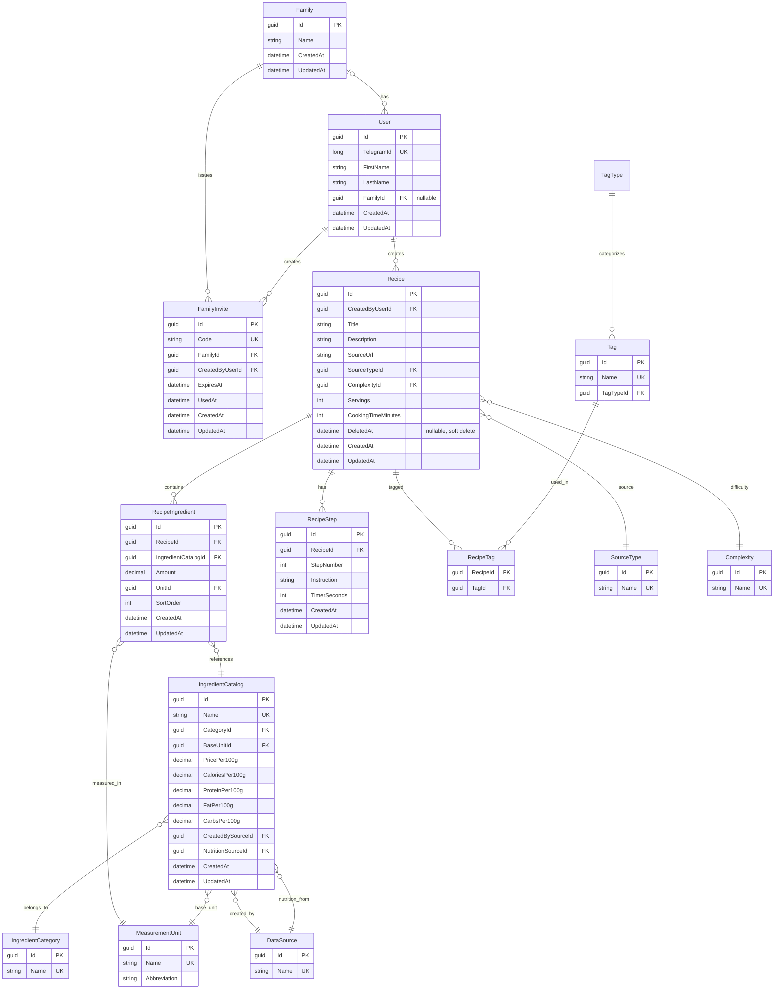

# CLAUDE.md

This file provides guidance to Claude Code (claude.ai/code) when working with code in this repository.

## О проекте

**Cooking** — личный кулинарный помощник. Telegram-бот + PWA. Изначально для автора и девушки, но бот можно расшарить друзьям: каждый пользователь самостоятельный, а семьи (Family) — группы, внутри которых рецепты общие.

Ключевая ценность: закинул ссылку на Reels/текст рецепта → бот сам достаёт рецепт, структурирует его через LLM и считает КБЖУ/стоимость по каталогу ингредиентов.

## Текущее состояние реализации

Готово: EF Core + миграции, справочники с seed'ом, CRUD каталога ингредиентов, тегов, Family/User с приглашениями, Recipe CRUD (доступ по семье, soft delete), Telegram-бот (регистрация и семьи; кнопки рецептов — заглушки), Serilog/Seq, юнит-тесты (xUnit + EF InMemory) и CI. Каждая фича — `I<Feature>RepositoryService` в Application + реализация в `Infrastructure/Repositories`, MediatR-хендлеры тонкие, ошибки — `FluentResults` + `AppError(ErrorCode)` → HTTP-статус в `BaseController`.

Ещё нет: авторизации (пока `UserId` передаётся в запросе), подсчёта КБЖУ/стоимости рецепта, LLM-парсинга, Worker/MassTransit, PWA.

Все проекты нацелены на **net8.0** (nullable + implicit usings включены).

## Структура решения

```
Cooking/
├── docker-compose.yml          # PostgreSQL + RabbitMQ
├── Cooking.sln
└── src/
    ├── Cooking.Domain/          # Entities, enums, interfaces (Class Library)
    ├── Cooking.Application/     # MediatR handlers, DTOs, use cases (Class Library)
    ├── Cooking.Infrastructure/  # EF Core, внешние API (Class Library)
    ├── Cooking.Bot/             # Telegram-бот: обработчик апдейтов, клавиатуры, polling/webhook (Class Library)
    ├── Cooking.Api/             # Web API; хостит бота в своём процессе (ASP.NET Core Web API)
    └── Cooking.Worker/          # MassTransit consumers — фоновая обработка (Worker Service)
```

Зависимости между проектами (Clean Architecture, ссылки идут только "внутрь"):

```
Domain ← Application ← Infrastructure
                     ← Bot ← Api (хостит бота)
                     ← Worker
```

Бот — такой же слой представления, как контроллеры Api, поэтому живёт в отдельной библиотеке, а не в Api/Application/Infrastructure. Когда Worker'у понадобится писать пользователю (например, «рецепт из Reels готов»), это делается через интерфейс в Application с реализацией в Infrastructure, а не ссылкой Worker → Bot.

## Стек

- .NET 8, C#
- PostgreSQL (EF Core, Code First, миграции)
- RabbitMQ + MassTransit (асинхронная обработка видео/аудио)
- MediatR (CQRS: commands/queries)
- Telegram.Bot SDK
- Whisper API (OpenAI) — Speech-to-Text
- Claude API / OpenAI API — структурирование рецептов через LLM
- SignalR — реалтайм (будущее: список покупок)
- PWA (фронтенд, будет позже)

## Команды

- Сборка всего решения: `dotnet build Cooking.sln`
- Запуск API: `dotnet run --project src/Cooking.Api`
- Запуск Worker: `dotnet run --project src/Cooking.Worker`
- Поднять инфраструктуру (Postgres на 5432, RabbitMQ на 5672 / management UI на 15672): `docker compose up -d`
- Тестового проекта пока нет; когда появится, точка входа — `dotnet test` (для одного теста: `--filter FullyQualifiedName~<Name>`)

## MVP — скоуп первой версии

### Платформы
- Telegram-бот — создание + поиск (делается первым)
- PWA — отображение рецептов (делается вторым)

### Создание рецептов
- Вручную (текст)
- Из Instagram Reels (скачивание аудио → Whisper → LLM → структурированный рецепт)

### Карточка рецепта
- Название, описание
- Ингредиенты (ссылка на каталог IngredientCatalog по ID)
- Пошаговые инструкции с таймерами
- Ссылка на источник (URL видео или сайта)
- КБЖУ (считается из каталога ингредиентов)
- Теги (тип приёма, кухня, сложность, время готовки)
- Стоимость (считается из каталога ингредиентов)
- Масштабирование порций

### Поиск
- По названию (полнотекстовый)
- Семантический (через LLM)

### Многопользовательность
- Много пользователей и много семей. `/start` регистрирует пользователя **без семьи**; дальше он может создать семью или вступить по приглашению
- Приглашение — одноразовый код с ограниченным сроком (FamilyInvite), передаётся deep link'ом `t.me/<bot>?start=<code>`
- Пользователь состоит максимум в одной семье. Последний вышедший участник удаляет семью
- Авторизация через Telegram Login Widget
- Рецепт принадлежит автору (CreatedByUserId), а не семье. В семье видны рецепты всех её участников; при вступлении/выходе ничего не переносится — рецепты уходят вместе с автором
- Права на рецепт: **смотреть и редактировать** — автор и участники его семьи; **удалять** — только автор. Постороннему API отвечает 404 (не 403), чтобы не раскрывать чужие рецепты
- Удаление рецепта — soft delete (`DeletedAt`), удалённые скрыты глобальным query filter'ом EF
- Общее в семье: рецепты участников, списки покупок (принадлежат семье)
- Личное: избранное

### Справочник ингредиентов
- Название, категория, КБЖУ на 100г, цена, единица измерения
- Автозаполнение через LLM при парсинге рецепта
- Два отдельных поля источника: кто создал запись (CreatedBySourceId) и откуда КБЖУ (NutritionSourceId)

### Отложено (не в MVP)
- Список покупок с реалтайм-синхронизацией (SignalR)
- Лайк/дизлайк от каждого пользователя
- YouTube, сайты как источники
- Поиск по фото продуктов, поиск по ингредиентам
- История готовок, рекомендации
- Импорт/экспорт в JSON
- Видимость рецепта (Private / Family / Public, справочник RecipeVisibility): владение (кто редактирует) ≠ видимость (кто видит)
- Общий каталог публичных рецептов (база знаний для всех пользователей, с пагинацией), шаринг рецепта ссылкой, «скопировать себе»

## Схема базы данных (Code First, EF Core + PostgreSQL)

Все основные entities наследуют `BaseEntity` (Id: Guid, CreatedAt: DateTime, UpdatedAt: DateTime).

### ERD (mermaid)


```mermaid
erDiagram
  Family |o--o{ User : has
  Family ||--o{ FamilyInvite : issues
  User ||--o{ FamilyInvite : creates
  User ||--o{ Recipe : creates
  Recipe ||--o{ RecipeIngredient : contains
  Recipe ||--o{ RecipeStep : has
  Recipe ||--o{ RecipeTag : tagged
  Tag ||--o{ RecipeTag : used_in
  TagType ||--o{ Tag : categorizes
  RecipeIngredient }o--|| IngredientCatalog : references
  RecipeIngredient }o--|| MeasurementUnit : measured_in
  IngredientCatalog }o--|| IngredientCategory : belongs_to
  IngredientCatalog }o--|| MeasurementUnit : base_unit
  IngredientCatalog }o--|| DataSource : created_by
  IngredientCatalog }o--|| DataSource : nutrition_from
  Recipe }o--|| SourceType : source
  Recipe }o--|| Complexity : difficulty

  Family {
    guid Id PK
    string Name
    datetime CreatedAt
    datetime UpdatedAt
  }

  User {
    guid Id PK
    long TelegramId UK
    string FirstName
    string LastName
    guid FamilyId FK "nullable"
    datetime CreatedAt
    datetime UpdatedAt
  }

  FamilyInvite {
    guid Id PK
    string Code UK
    guid FamilyId FK
    guid CreatedByUserId FK
    datetime ExpiresAt
    datetime UsedAt
    datetime CreatedAt
    datetime UpdatedAt
  }

  Recipe {
    guid Id PK
    guid CreatedByUserId FK
    string Title
    string Description
    string SourceUrl
    guid SourceTypeId FK
    guid ComplexityId FK
    int Servings
    int CookingTimeMinutes
    datetime DeletedAt "nullable, soft delete"
    datetime CreatedAt
    datetime UpdatedAt
  }

  SourceType {
    guid Id PK
    string Name UK
  }

  Complexity {
    guid Id PK
    string Name UK
  }

  IngredientCatalog {
    guid Id PK
    string Name UK
    guid CategoryId FK
    guid BaseUnitId FK
    decimal PricePer100g
    decimal CaloriesPer100g
    decimal ProteinPer100g
    decimal FatPer100g
    decimal CarbsPer100g
    guid CreatedBySourceId FK
    guid NutritionSourceId FK
    datetime CreatedAt
    datetime UpdatedAt
  }

  IngredientCategory {
    guid Id PK
    string Name UK
  }

  DataSource {
    guid Id PK
    string Name UK
  }

  MeasurementUnit {
    guid Id PK
    string Name UK
    string Abbreviation
  }

  RecipeIngredient {
    guid Id PK
    guid RecipeId FK
    guid IngredientCatalogId FK
    decimal Amount
    guid UnitId FK
    int SortOrder
    datetime CreatedAt
    datetime UpdatedAt
  }

  RecipeStep {
    guid Id PK
    guid RecipeId FK
    int StepNumber
    string Instruction
    int TimerSeconds
    datetime CreatedAt
    datetime UpdatedAt
  }

  Tag {
    guid Id PK
    string Name UK
    guid TagTypeId FK
  }

  RecipeTag {
    guid RecipeId FK
    guid TagId FK
  }
```

### Основные таблицы

#### Family
- Id (Guid, PK)
- Name (string)
- CreatedAt, UpdatedAt

#### User
- Id (Guid, PK)
- TelegramId (long, unique)
- FirstName (string)
- LastName (string?)
- FamilyId (Guid?, FK → Family) — null, пока пользователь не состоит в семье
- CreatedAt, UpdatedAt

#### FamilyInvite
- Id (Guid, PK)
- Code (string, unique, ≤ 64 символов `[A-Za-z0-9_-]` — ограничение start-параметра Telegram)
- FamilyId (Guid, FK → Family, cascade delete)
- CreatedByUserId (Guid, FK → User)
- ExpiresAt (DateTime) — срок действия (7 дней)
- UsedAt (DateTime?) — null, пока приглашение не использовано (одноразовое)
- CreatedAt, UpdatedAt

#### Recipe
- Id (Guid, PK)
- CreatedByUserId (Guid, FK → User) — владелец рецепта
- Title (string)
- Description (string?)
- SourceUrl (string?)
- SourceTypeId (Guid, FK → SourceType)
- ComplexityId (Guid, FK → Complexity)
- Servings (int)
- CookingTimeMinutes (int)
- DeletedAt (DateTime?) — soft delete; не null → рецепт удалён (query filter прячет его и его ингредиенты/шаги/теги)
- CreatedAt, UpdatedAt

КБЖУ и стоимость в Recipe **не хранятся** — см. «Архитектурные решения».

#### IngredientCatalog
- Id (Guid, PK)
- Name (string, unique)
- CategoryId (Guid, FK → IngredientCategory)
- BaseUnitId (Guid, FK → MeasurementUnit) — базовая единица для расчёта КБЖУ
- PricePer100g (decimal)
- CaloriesPer100g (decimal)
- ProteinPer100g (decimal)
- FatPer100g (decimal)
- CarbsPer100g (decimal)
- CreatedBySourceId (Guid, FK → DataSource) — кто создал запись (Manual, LLM, FatSecret)
- NutritionSourceId (Guid, FK → DataSource) — откуда КБЖУ (Manual, LLM, FatSecret)
- CreatedAt, UpdatedAt

#### RecipeIngredient
- Id (Guid, PK)
- RecipeId (Guid, FK → Recipe)
- IngredientCatalogId (Guid, FK → IngredientCatalog)
- Amount (decimal)
- UnitId (Guid, FK → MeasurementUnit) — единица в этом рецепте (может отличаться от базовой)
- SortOrder (int) — порядок отображения
- CreatedAt, UpdatedAt

#### RecipeStep
- Id (Guid, PK)
- RecipeId (Guid, FK → Recipe)
- StepNumber (int) — порядок шага (1, 2, 3...)
- Instruction (string) — текст шага
- TimerSeconds (int?) — если заполнено, PWA показывает кнопку таймера
- CreatedAt, UpdatedAt

#### Tag
- Id (Guid, PK)
- Name (string, unique)
- TagTypeId (Guid, FK → TagType)

#### RecipeTag (промежуточная, many-to-many)
- RecipeId (Guid, FK → Recipe)
- TagId (Guid, FK → Tag)
- Composite PK: (RecipeId, TagId)

### Справочники (reference tables, заполняются при seed)

Все справочники: Id (Guid, PK) + Name (string, unique). Без CreatedAt/UpdatedAt.

- **SourceType** — источник рецепта: Manual, Instagram, YouTube, Website
- **Complexity** — сложность: Easy, Medium, Hard
- **IngredientCategory** — категория ингредиента: Мясо, Овощи, Крупы, Молочные, Специи и т.д.
- **MeasurementUnit** — единица измерения: г, мл, шт, ст.л., ч.л. (поля: Name, Abbreviation)
- **DataSource** — источник данных: Manual, LLM, FatSecret
- **TagType** — тип тега: MealType, Cuisine, CookingMethod, Diet
- **Tag** (не чистый справочник: есть TagTypeId) — базовый набор тегов по каждому типу

Seed — через `HasData` в EF-конфигурациях, значения в `Infrastructure/Persistence/Seed/ReferenceDataSeed.cs`. Id фиксированные: константы в `Cooking.Domain/ReferenceData/ReferenceIds.cs` (например, `ReferenceIds.SourceTypes.Instagram`) — код ссылается на них напрямую, а не ищет по имени. Добавил/изменил seed → новая миграция; Id уже существующих записей не менять.

## Архитектурные решения

- Все enums вынесены в отдельные справочные таблицы (не enum в коде)
- Many-to-many для тегов через промежуточную таблицу RecipeTag — соблюдает 3НФ
- КБЖУ и стоимость рецепта **не хранятся**, а считаются из IngredientCatalog: `amount × catalogValue / 100` — так изменение цены/КБЖУ ингредиента сразу отражается во всех рецептах. План: Postgres VIEW (`v_recipe_nutrition`), делается после базового Recipe CRUD, когда будут реальные рецепты для проверки. Пока без коэффициентов пересчёта единиц: в расчёт идут только ингредиенты, у которых единица в рецепте совпадает с базовой единицей в каталоге
- Порции: пока одинаковые (`Servings`). Личный размер порции / вес готового блюда — отложено
- Масштабирование порций — пересчёт на фронте, базовые Servings хранятся в Recipe
- Обработка Instagram-видео асинхронная через RabbitMQ: бот кидает сообщение → Worker скачивает, транскрибирует, парсит → отправляет результат обратно
- BaseEntity (Id, CreatedAt, UpdatedAt) — базовый класс для всех основных entities

## Telegram-бот

- Код в `src/Cooking.Bot/`; Api подключает его двумя строками: `AddTelegramBot(configuration)` и `app.MapTelegramWebhook()`. Вся логика — `BotUpdateHandler` (scoped, работает через MediatR); транспорт выбирается настройкой `Telegram:UseWebhook`:
  - `false` (разработка) — `BotPollingService`, long polling, публичный адрес не нужен;
  - `true` (прод) — `TelegramWebhookEndpoint` (minimal API `POST /api/telegram/webhook`, маршрут есть только в webhook-режиме; проверяет заголовок `X-Telegram-Bot-Api-Secret-Token`) + `BotWebhookRegistrationService` регистрирует webhook при старте.
- Для разработки — отдельный dev-бот (Telegram не даёт одному боту одновременно polling и webhook).
- Токен **никогда** не коммитится: локально `dotnet user-secrets set "Telegram:BotToken" "<token>" --project src/Cooking.Api`, в проде — переменные окружения `Telegram__BotToken`, `Telegram__UseWebhook=true`, `Telegram__WebhookUrl`, `Telegram__WebhookSecretToken`.
- Без токена Api стартует без бота (REST работает).
- Бот не хранит состояние диалога. Поиск рецептов: `/search <запрос>`, либо кнопка «Найти рецепт» / `/search` без аргументов → список + сообщение `BotTexts.SearchPrompt` с ForceReply, и ответ на него = запрос. Обычный текст без команды поиском не считается — он зарезервирован под LLM-парсинг рецептов. Список команд (`BotCommandNames.All`) регистрируется в Telegram при старте.

## Docker (локальная разработка)

Postgres (`recipe-db`, порт 5432) и RabbitMQ (`recipe-mq`, AMQP 5672 / management UI 15672) — см. `docker-compose.yml` в корне.

## Connection strings (appsettings.Development.json)

```json
{
  "ConnectionStrings": {
    "DefaultConnection": "Host=localhost;Port=5432;Database=recipe_db;Username=recipe_user;Password=recipe_pass"
  },
  "RabbitMq": {
    "Host": "localhost",
    "Username": "guest",
    "Password": "guest"
  }
}
```

Сейчас эта конфигурация уже есть в `src/Cooking.Api/appsettings.Development.json`; в `Cooking.Worker/appsettings.Development.json` её пока нет.

## Хостинг (прод)

- VPS: Hetzner CX23 (2 vCPU, 4GB RAM, 40GB SSD, ~€4/мес)
- Всё в Docker на VPS
- Whisper API + LLM API: ~$2-4/мес при 20-30 рецептах


ИДея: Добавить Функционал сканирования чека. Считать КБЖУ из чека + стоимость
